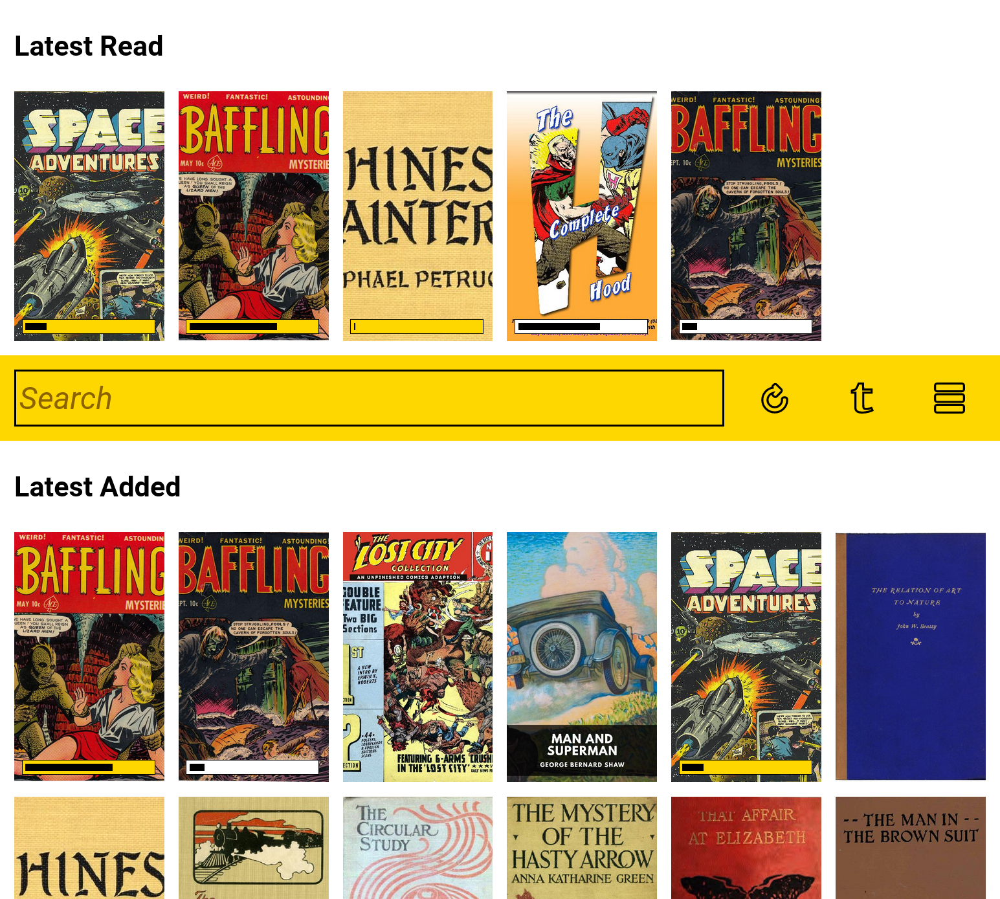
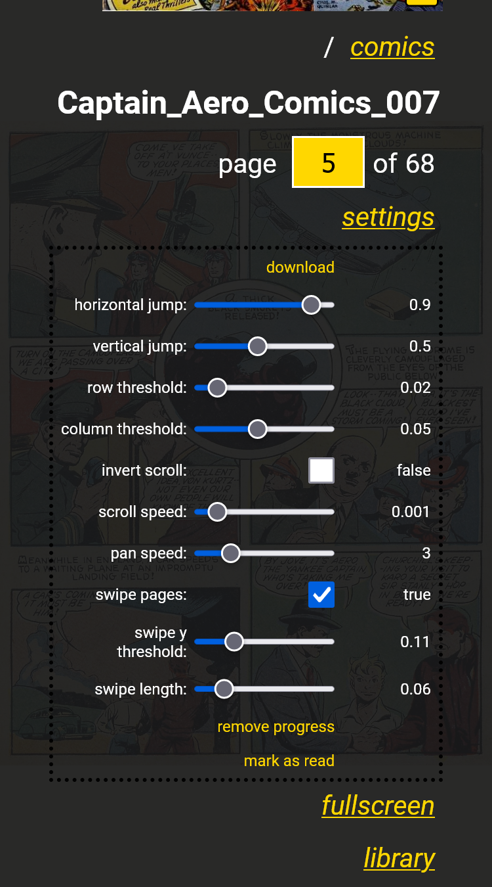
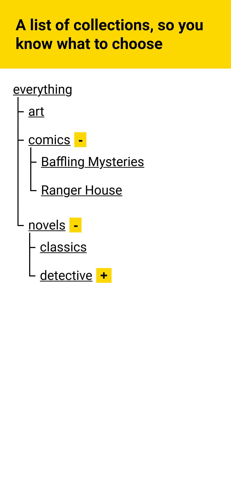
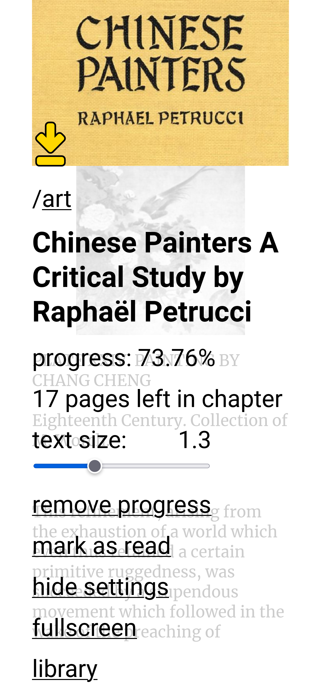

# Chronic Reader



## Description

This is a server application that you can use to access your 
collection of ebooks and comic books remotely, read them and
keep read progress across multiple devices. The application
is browser based and designed to work well with both desktop
and mobile devices.

- [Features](#features)
- [Prerequisites](#prerequisites)
- [Installation instructions](#installation-instructions)
- [Creating users and other admin functions](#creating-users-and-other-admin-functions)
- [Configuration properties](#configuration-properties)
- [Backing up and restoring data](#backing-up-and-restoring-data)
- [Updating the service](#updating-the-service)
- [Troubleshooting - Resetting everything](#troubleshooting---resetting-everything)
- [Installing as a service on Windows](#installing-as-a-service-on-windows)
- [Running with Docker](#running-with-docker)
- [Other considerations](#other-considerations)

## Features

- supports reading CBR, CBZ, PDF and EPUB files
- store latest read books on device for offline reading
- scan and monitor a library folder for supported file types

||
--- | --- | ---
_Book page_ | _Comic page_ | _Comic tools and settings_

- open and display supported file types in browser
- keep track of position user has reached in a comic book or ebook
- continue reading from the latest position
- keep track of read ebooks and comic books

||
| --- | 
| _Collections tree_ |

- view books and comic books organized by collections (the subfolders they
are stored in on disk)
- search for comic books and ebooks

||
--- | --- | ---
_Book tools and settings_ | _Book dark mode_ | _Configuring number of books saved on device_

- supports device specific settings for book background and foreground colors, book dark mode, number of books saved on device
- add multiple users
- import or export users and book progress information
- change password functionality

## Prerequisites

Download and install the latest java for your operating system. Once all is done, open a command line and verify that
java was installed correctly with the following command:

```
java -version
```

## Installation instructions

1. Download the latest release from [releases](../../releases).
2. Copy the release JAR to a folder on disk. This is where the application will start in and will create the database
files.
3. Create an `application.properties` file and, using a text editor, configure your app as described in the code below.
Set the `<library_folder>` to an address on disk where your ebook and comic book collection is. Set a strong
`<administrator_password>`, you will use this for the first login and creating users for your application. Set
a `<port>` that is unoccupied on your machine, a good option is `8080`.

```
library.location=<library_folder>
adminPass=<administrator_password>
server.port=<port>
```

4. Start the application by opening a command line and running: `java -jar reader-<version>.jar` (be sure to
replace `version` with the version you downloaded).
5. When you want to stop the application you can press `ctrl-c` to send the kill signal to the process.

## Creating users and other admin functions

Once you have started the application, you can navigate in a browser to `localhost:<port>` address (use the port you
configured). There you should see the login page. Log in with the `admin` username and the `<administrator_password>`
you configured in the properties file.


On the main page, click the "More" button. In the settings screen, click on "Import Data". This takes you to the administration
functions screen. Only the admin user has access to this screen. You can create the users
you need for your app in this screen by writing a username, a comma and a password for each user you want to create,
on different lines. Then press "Add users". The users will have the option to change their password to what they prefer.

## Configuration properties

- `keepEbookStyles=false`
    - It is recommended to set the `keepEbookStyles` setting to false, to get a more consistent experience with ebooks,
    but you can experiment with this and change it to true.
    
## Backing up and restoring data

To back up your user data and progress data, you can log in with the admin user and click the settings button and then go to the "Import data" screen. On that screen you can click the "Export progress" and the "Export users" buttons to save this information as CSV files on your computer.

To restore this data, on a new database, you need to use the admin user and navigate to the "Import data" screen. On this screen, you should first import users by opening the exported users CSV file with a text editor and copying the information there into the "csv data" text area. Then press the "Import users" button.

Importing progress should be done after you have imported or created the users and the book collection has been imported. You can check the logs, the `reader.log` file in the folder where your application is installed, to see that collection scanning has been completed. A message saying "full scan done" should be on the last line in the file if the collection has been imported. Once the import process is done, you can now import progess to you database by going to the "Import data" screen, copying the text from the progress CSV file into the "csv data" text area, then pressing the "Import progress" button.

## Updating the service

The following steps are recommended when you want to update the Chronic Reader service to a new version:

1. Export users and progress;
2. Stop the Chronic Reader application;
3. Copy the new version, downloaded from [releases](../../releases), to the installation folder;
4. Start the application with new version using `java -jar reader-<version>.jar`
5. The database files from the previous version should be available and compatible, but just in case, check to see that the users and progress have been maintained;
6. If data was corrupted and the old users and progress information are no longer available in the application, you can import the users and progress that were saved in the first step.

## Troubleshooting - Resetting everything

If there are issues with the application, the application throws an error and can't start, possible after an upgrade to a new version, one way to try and fix it is to recreate the database. For this, you should have the exported users and progress CSV files, obtained by following instructions in the [backing up and restoring data section](#backing-up-and-restoring-data).

You will need to stop the application, then delete the following four files:

- `reader_db.lck`
- `reader_db.log`
- `reader_db.properties`
- `reader_db.script`

Afterwards, restart the application. The database will be recreated, your library folder will be rescanned. Once scanning is done, you can open the application with the admin account and navigate to the "Import data" screen, where you can reimport the old users and progress.

## Installing as a service on Windows

This application is designed to run as a service on a server. You can easily run
this application as a service on Windows using the [Non-Sucking Service Manager](https://nssm.cc/).

## Running with Docker

You can run the chronicreader server with docker using the following command:

```
docker run -d -e ADMIN_PASSWORD=??? -e SERVER_PORT=8086 -p 8086:8086 -v d:\books:/books -v c:\reader_db:/db chronicweirdo/chronicreader:4.5
```

You need to provide the following parameters:

- `-d` - run in detached mode, keep the server running in the background
- `-e ADMIN_PASSWORD=???` - replace `???` with a strong admin password for your server
- `-e SERVER_PORT=8086 -p 8086:8086` - choose the port to run your server on, in this example port `8086`, and bind your docker port to the `localhost` port
- `-v d:\books:/books` - bind your local book collection folder, in this example `d:\books`, to the books folder expected in the server image
- `-v c:\reader_db:/db` - bind a local database folder, in this example `c:\reader_db`, to the database folder expected in the image; this is necessary to keep your read progress data between server restarts

Or you can run this with docker compose:

``` yml
version: '3'
services:
  reader:
    image: chronicweirdo/chronicreader:4.5
    environment:
      - ADMIN_PASSWORD=???
      - SERVER_PORT=8086
    ports:
      - "8086:8086"
    volumes:
      - c:\reader_db:/db
      - d:\books:/books
    restart: unless-stopped
```

[Docker Hub entry for this project](https://hub.docker.com/r/chronicweirdo/chronicreader)

## Performance Considerations

If you are running in Docker on Windows using the WSL2 subsystem engine there may be
a performance impact depending on your setup. This performance impact occurs when
you mount a Windows folder, with a Windows file system, into the Linux Docker
container that is running Chronic Reader. This file system translation will make
interaction with the file system slow, meaning that library scanning will work
a lot slower than it would on Windows. This performance impact does not occur if
you are using Docker with Hyper-V instead of WSL2.

This performance impact is especially felt when starting the container, since
at that point a library check, which scans all books and verifies their checksum,
occurs. To mitigate this, you now can set an environment to turn off library
verification: `VERIFY_ON_INITIAL_SCAN=false`.

When running on Windows Docker on WSL2 folder change watching will not work. To make the
application discover changes in your library folder you will have to disable folder
watching by setting `ENABLE_FOLDER_WATCHING=false`; this will enable the periodic folder
rescan mechanism which will be able to detect changes in your library folder.

See information about performance considerations when running in Docker on Windows
for version 4.6 on the [4.6 release page](https://github.com/chronicweirdo/reader/releases/tag/v4.6).

## Setting Up the Service

Whether when running with docker or as a Windows service, there are a series of
startup settings you can use to configure your deployment. This is done through
environment variables or settings in the `application.properties` file.

- `adminPass` property or `ADMIN_PASSWORD` environment variable: the hardcoded admin password
- `server.port` property or `SERVER_PORT` environment variable: the port the server listens to
- `debug` property or `DEBUG` environment variable: `true` or `false` to enable or disable debug 
mode logs on the server
- `logging.level.com.cacoveanu` property or `LOG_LEVEL` environment variable: values can be 
`TRACE`, `DEBUG`, `INFO`, `WARN` and `ERROR`, to set the log level of the Chronic Reader app
- `enableFolderWatching` property or `ENABLE_FOLDER_WATCHING` environment variable: if set 
to `false` it will turn off the folder watching mechanism and enable the periodic library 
rescan mechanism
- `verifyOnInitialScan` property or `VERIFY_ON_INITIAL_SCAN` environment variable: use `true` or
`false` to enable or disable library verification when the application starts up
- `server.tomcat.threads.max` property or `SERVER_TOMCAT_MAX_THREADS` environment variable: set
the number of Tomcat threads the application should use
- `SETTING_THEME_DEFAULT` environment variable: values `0`, `1`, `2`, `3` correspond to "light",
"OS theme", "time based" and "dark"
- `SETTING_DARK_BACKGROUND_COLOR_DEFAULT` environment variable: default dark theme background color HEX code (example: `"#000000"`)
- `SETTING_DARK_TEXT_COLOR_DEFAULT` environment variable: default dark theme text color HEX code
- `SETTING_DARK_ACCENT_COLOR_DEFAULT` environment variable: default dark theme accent color HEX code
- `SETTING_DARK_ACCENT_TEXT_COLOR_DEFAULT` environment variable: default dark theme accent text color HEX code
- `SETTING_LIGHT_BACKGROUND_COLOR_DEFAULT` environment variable: default light theme background color HEX code
- `SETTING_LIGHT_TEXT_COLOR_DEFAULT` environment variable: default light theme text color HEX code
- `SETTING_LIGHT_ACCENT_COLOR_DEFAULT` environment variable: default light theme accent color HEX code
- `SETTING_LIGHT_ACCENT_TEXT_COLOR_DEFAULT` environment variable: default light theme accent text color HEX code
- `SETTING_LATEST_READ_LIMIT_DEFAULT` environment variable: default latest read books to load (example: `6`)
- `SETTING_LATEST_ADDED_LIMIT_DEFAULT` environment variable: default latest added books to load (example: `24`)
- `SETTING_DAY_START_DEFAULT` environment variable: default day start hour and minute (example: `"07:00"`)
- `SETTING_DAY_END_DEFAULT` environment variable: default day end hour and minute (example: `"22:00"`)
- `LOGO_BACKGROUND` environment variable: background color HEX code for the generated logo
- `LOGO_FOREGROUND` environment variable: foreground color HEX code for the generated logo

## Other considerations

If you want to make this service available on the internet, you should add SSL,
which can be done using a reverse proxy server like [nginx](https://nginx.org/).

All comic books used for testing and illustration purposes are from 
the [Digital Comic Museum](https://digitalcomicmuseum.com).

All ebooks used for testing and illustration purposes are from
[Project Gutenberg](https://www.gutenberg.org) and [Standard Ebooks](https://standardebooks.org).
