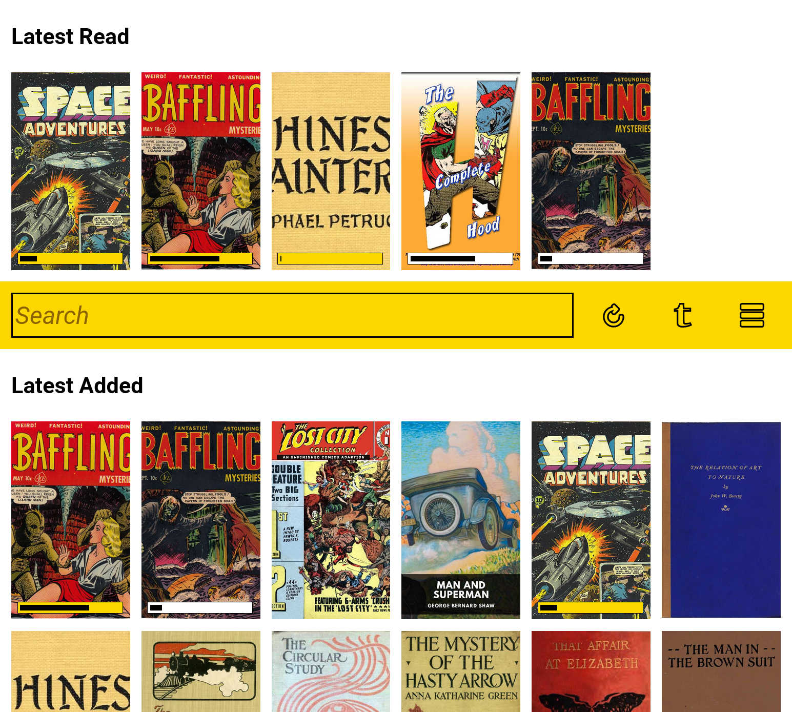
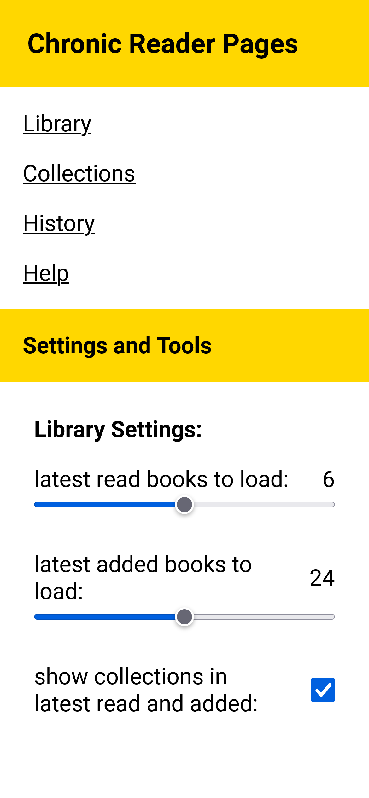
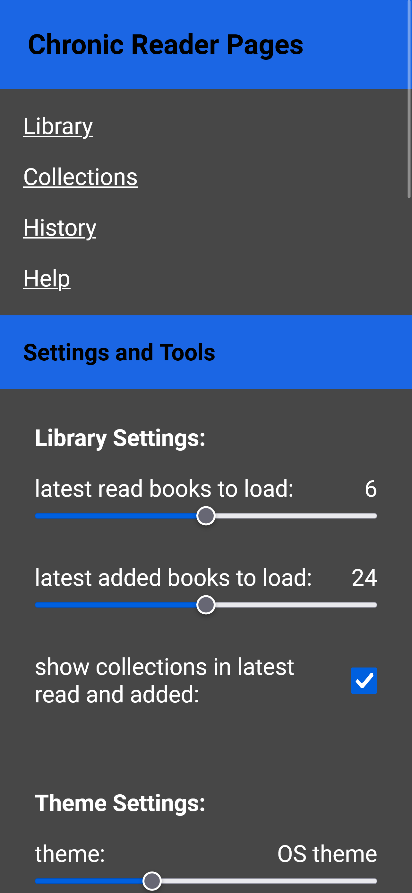
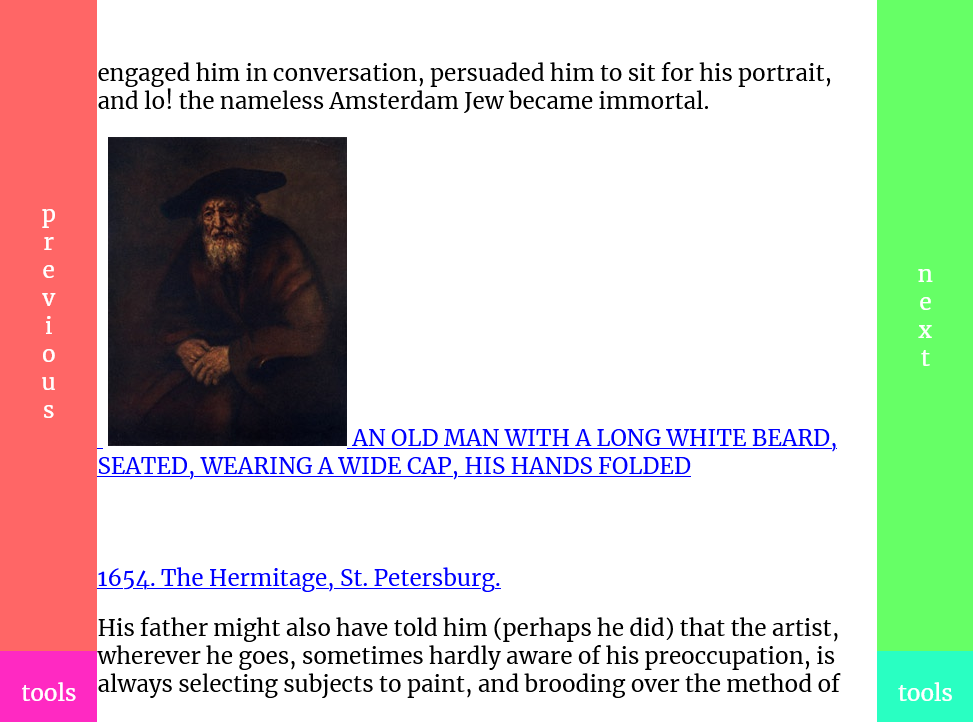
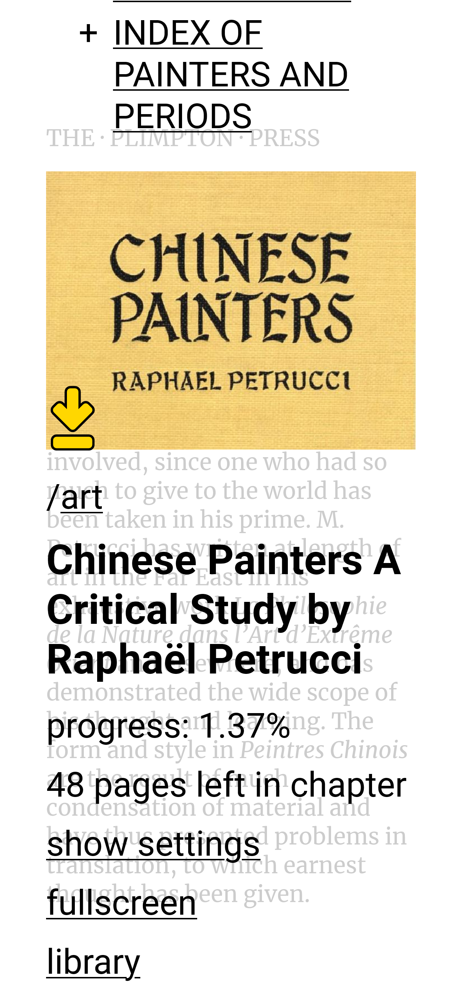
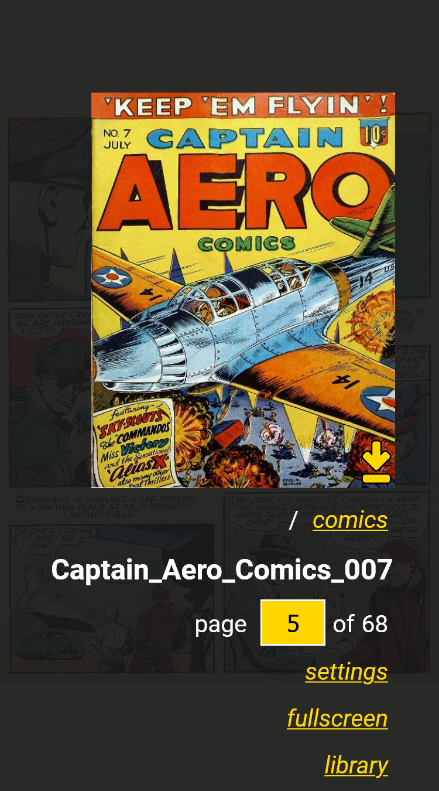
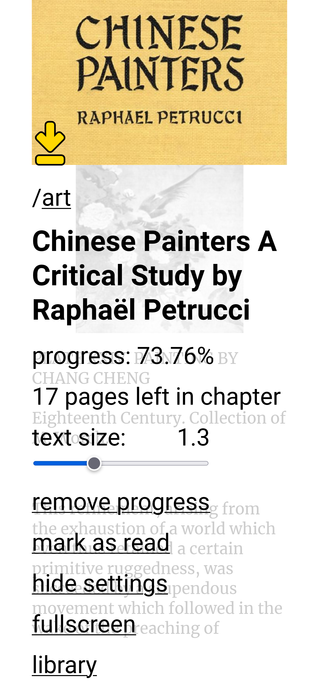
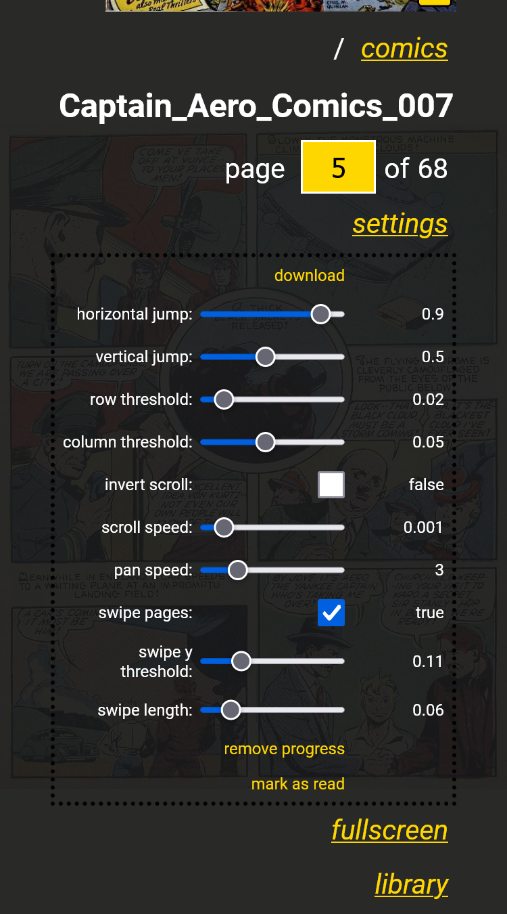

# Chronic Reader Help

- [About the Library Page](#about-the-library-page)
- [About the Application Settings Page](#about-the-application-settings-page)
- [About the Collections Page](#about-the-collections-page)
- [About Book Pages](#about-book-pages)
- [About Comic Book Pages](#about-comic-book-pages)

## About the Library Page

library page

This page lets you navigate the available collections of books and comics, search, view progress of books you have opened and read. New books are loaded as you scroll, with their corresponding collections. You can click on parts of collection names to search for all comics in that specific collection, or you can use the search field directly to look for available books. Click on a book or comic to start reading it. At the top of the page, the most recent books you read are displayed. Books that are in progress have a progress bar displayed on top of their cover. Books that have been read (cover to cover) have a checkmark displayed on top of their cover.

Books that are stored on the device have a golden progress bar, while those that are not available offline have a white progress bar. For each device the latest read books are downloaded on the device to be accessible offline. This process may take a while, depending on the size of those books, so not all boooks in the latest read section will have a golden progress bar immediately.

On the library page you also have three buttons/controls. The clear search button will clear the search field and reload the entire library from the beginning. If the search field is empty, you can click the clear search button to refresh the entire page. This option is useful on iOS when you install the application as a Progressive Web App and you need to refresh the library page. The next button is toggle titles which will show or hide the titles of each book on the library page. This button has a device-specific setting behind it, and its state will be remembered between refreshes. The last button is a link to the Application Settings page.

[top](#chronic-reader-help)

## About the Application Settings Page

application settingscustomized UI colors

On this page you have access to other parts of the application and to some global configuration settings.

The links here will take you back to the Library page, or you can visit the Collections page, the History page and this Help page.

In the settings section you can change the number of latest read books to load in the library. Since the latest read books are also downloaded on your device, this is where you can control how much data to store on your device. This setting is device specific, you can store a different number of books on your mobile phone than you store on your tablet. Here you can also change the user interface colors. These settings are also device specific, so you can have different color schemes for different devices on the same account.

On this page you also have links to change your password or to clear the local cache. Clearing the cache will delete all data stored on the device, books and settings. Use this if something is not working well and you need to reset the application.

The last option on this page is to log out of the application. Logging out will also clear all books and settings stored on the device.

[top](#chronic-reader-help)

## About the Collections Page

collections tree

Every book and comic is part of a collection, based on the folders and sub-folders it is stored in. The collections page displays all the collections in the app as a tree. For tree entries with a plus sign next to them you have sub-collections. You can click that plus sign to expand the collection and view sub-collections. You can organize your books and comics into collections by organizing them into sub-folders in your root library folder. Clicking on a collection name will take you back to the library page and only display the entries in that collection.

[top](#chronic-reader-help)

## About Book Pages

book controls

You can use the highlighted areas of the screen to move between pages/views or to open the tools menu.

tools menu on the lefttools menu on the right

The tools menu has a left-side and a right-side version, depending on the tools button you pressed. It is designed to be easy to use with whatever hand you hold your device in.

book display pagebook toolsbook settings

If you open the tools menu for a book you can see progress information, what percentage of the book you have read and how many pages are left in the current chapter. You can also expand the settings, where you can switch to dark mode for night-time reading, pick preferred colors for background and text for both dark and light modes, change the text size. You can also toggle fullscreen, if your device permits this (this does not work on iOS devices), and you can delete the progress for the current book.

book table of contentsbook dark mode

Above the standard tools you can also view the table of contents of the book, with expandable chapters and subchapters that you can click to jump to the desired position in the book.

[top](#chronic-reader-help)

## About Comic Book Pages

comic pagecomic toolscomic settings

You can pinch-zoom or use the mouse wheel to adjust the zoom of the comic page. Press left mouse and drag or touch screen and drag to adjust the position of the comic page. A double left click or a double tap on the center of the screen zooms you in or out on the comic page.

You can move between positions in a comic by tapping the left and right sides of the screen. If the comic is zoomed out and the whole page is visible on your screen, the next position will be the next page. If the comic is zoomed in, tapping the right side of the screen will jump to then next part of the current comic page. The same functionality works with moving to previous positions, and if you are on the last segment of a page, the next position will automatically move you to the next page. If you have a keyboard, you can use the arrow keys or W/A/S/D to navigate.

On the comic tools page, accessed by clicking/tapping the lower left or right sides of the screen, you can jump to any page of the comic. You can also open the settings that allow you to change the scroll and pan speeds, or invert the mouse scroll. Also inside settings you can download the current comic book page as an image or delete the progress for the current comic.

[top](#chronic-reader-help)